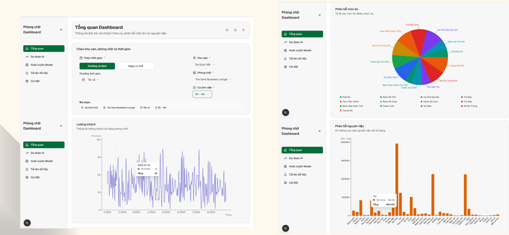
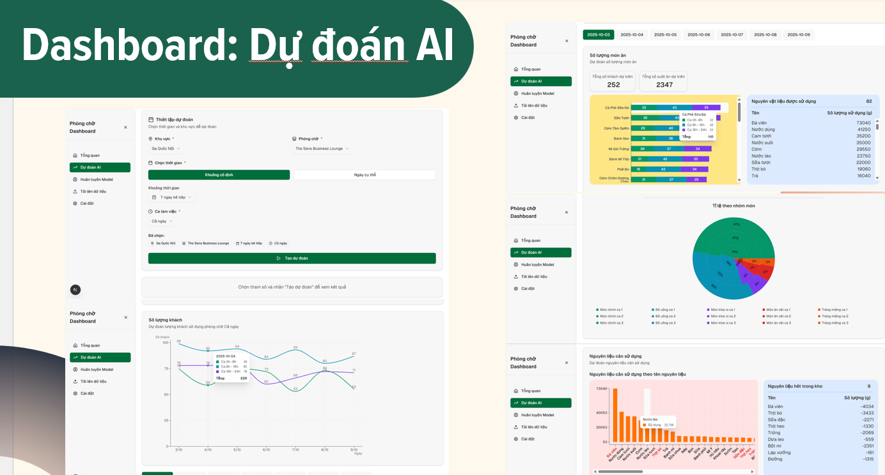
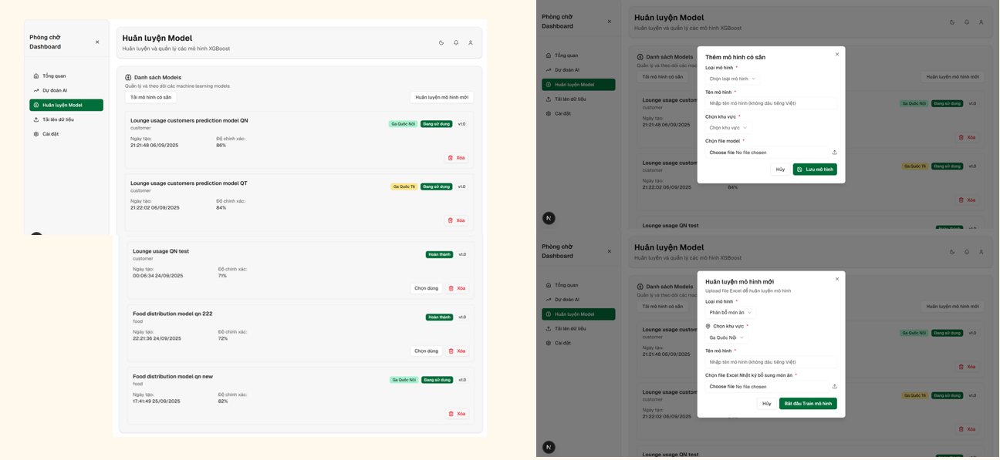

# CIP Dashboard – AI-powered Business Intelligence System

## 📌 Overview
CIP Dashboard is a web-based system that integrates AI models to support business decision-making.  
The system analyzes operational data to predict lounge usage and forecast menu demand, helping optimize inventory and improve efficiency for airport restaurant chains.

---

## ✨ Key Features
- 🤖 AI-based prediction:
  - Lounge usage prediction
  - Menu demand forecasting
- 📦 Inventory optimization (re-order point calculation)
- 🔍 Data filtering, search, analytics
- 📈 Charts and business reports

---

## 🛠️ Tech Stack

### Frontend
- NextJS
- TailwindCSS
- Chart.js

### Backend
- FastAPI

### AI / Data Processing
- Python
- Pandas, NumPy
- XGBoost, Bayer Hierarchy, Optuna
### API
- Open Meteo API (API Weather)

### Database
- PostgreSQL (Supabase)

---

## 🧠 AI Pipeline
1. Data Collection  
2. Data Preprocessing  
3. Feature Engineering  
4. Model Training  
5. Model Evaluation  
6. API Integration  

---

## 📸 Demo

---
